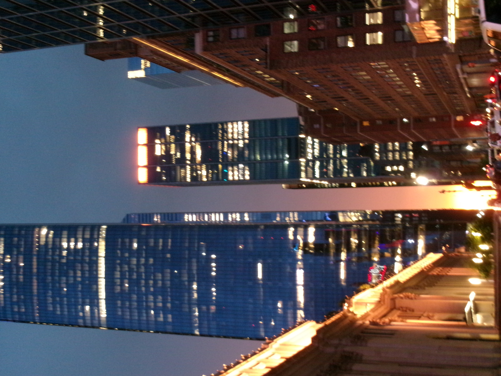
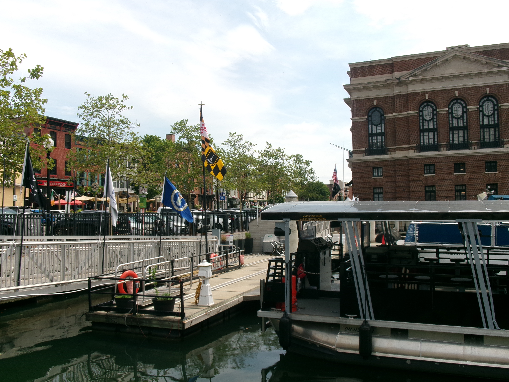

Hi! I'm Ashi 
When I'm not analyzing astronomical data, you'll probably find me curled up with a good book, searching for a new cafe or a matcha place, or making one myself!

---

## Books

Reading has always been one of my favorite ways to unwind and learn something new. I enjoy and read all genres, but my favorite ones are historical fiction, mystery/thriller, and science fiction.

### Favorites

| | | |
|---|---|---|
|  |  |  |  |  |  | 
| *The Seven Husbands of Evelyn Hugo* | *The Invisible Life of Addie LaRue* | *My Dark Vanessa* | *A Good Girl's Guide to Murder trilogy* | *Animal Farm* | *Three Body Problem* | *Before the Coffee Gets Cold* 

#### Honorable Mentions: 
Harry Potter (my roman empire), Percy Jackson, To All the Boys trilogy

### Favorite Authors

- Taylor Jenkins Reid
- Victoria (V.E.) Schwab
- Holly Jackson
- Madeline Miller

---

## Coffee & Matcha

One of my favorite hobbies is making iced lattes and matcha at home and discovering local cafés, especially when I travel

Some of my favorite iced lattes/matcha recipes:
- Banana Bread 
- White Chocolate
- Salted Vanilla Maple
- Cinnamon Brown Sugar

### Café Gallery

| | |
|---|---|
|  |  |  |  |  |  |  | 

---

## Favorite Media

### Movies

- Interstellar
- Good Will Hunting
- Obsession
- The Odyssey
- Oppenheimer

(as you can tell, I LOVE Christoper Nolan)

### Shows

- The Haunting of Hill House
- Stranger Things
- Gilmore Girls
- The Office
- Daisy Jones and the Six

#### Honorable Mentions: 
Squid Game, Manifest, Modern Family

---

## Dance

Dance has been one of the most rewarding parts of my college experience.

At UIUC I have been a member of

- **UIUC Chammak**, where I also served as **Vice President**
- **Ghungroo Dance Company (GDC)**

These experiences taught me leadership, teamwork, and how much fun performing with friends can be.

|---|---|
|  |  |  | 

---

## Travel

One of my biggest goals is to explore as much of the world as I can. My current bucketlist destinations are: 
- Norway
- Netherlands
- Alaska
- Japan
- Yi Peng Lantern Festival Thailand
- Paris, Hawaii
- Maine roadtrip: Acadia National Park, Grafton Notch, Bass Harbor, Portland Headlight

Places I have visited:
- Mauritius
- Maldives
- Thailand: Krabi, Phuket
- Puerto Rico

## Favorite Places

| | | |
|---|---|---|
|  |  |  |  |  |  |  |  |  |  |  |  |  |  |  |  | 

---
