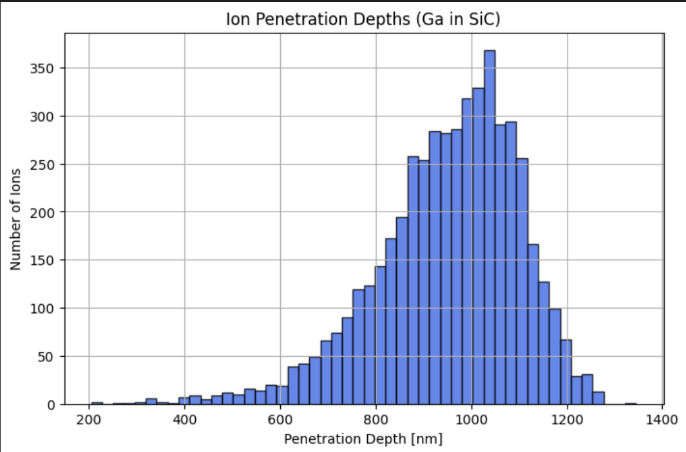

Worked at **[QuantCAD](https://www.quantcad.com/)** as a quantum physics & tech research intern, a quantum technology startup focused on semiconductor modeling, quantum sensing, and device-level simulation. 
I also attended the **CQE OQI Symposium**, where I explored various quantum technology projects and networked with leading academics, industry researchers, and experts. Additionally, I participated in **Tech Chicago Week’s internship event**, connecting with peers across the Chicago tech ecosystem and gaining insights into emerging technology trends.  

---

## Key Contributions

- Conducted **simulation-driven quantum device research**, supporting irradiation experiments and defect engineering in semiconductor systems.
- Performed **optics-based data analysis** for NV-center experiments, studying magnetic-field-dependent quantum signal response.
- Designed and modeled **Halbach array magnet configurations** to optimize field uniformity and experimental feasibility.
- Contributed to development of **all-electric, high-temperature magnetometry systems** based on NZFMR.

---

## Simulation & Modeling Work

A major component of my work focused on **ion implantation simulations and defect engineering**:

- Used **SRIM/TRIM simulations** to model Carbon-12 ion implantation in 4H-SiC devices  
- Optimized **beam energy and penetration depth (~1 μm target)** to align defect creation with the p–i junction  
- Analyzed **ion distribution, straggle, and vacancy generation profiles** to predict recombination behavior  
- Informed **experimental irradiation parameters** before national lab beam time  

### Ion Implantation Depth Simulation

- Peak ion penetration centered at ~1050–1100 nm  
- Narrow distribution ensured precise targeting of active device region  
- Enabled controlled defect engineering for NZFMR response  

---

## Optics & Experimental Data Analysis

- **Data Acquisition:** Measured fluorescence under currents 0, 25, 50, 75 mA; converted frequencies to GHz.  
- **Peak Analysis:** Applied **double Gaussian fitting** to identify fluorescence peaks for each current condition.  
- **Magnetic Field Extraction:** Converted current to magnetic field (mT), aligned with NV centers, and fitted linear relation between peak separation and field.  
- **Rabi Oscillations:** Measured oscillation frequency and amplitude under varying microwave pulse length and amplitude to determine **quantum control parameters**.  

**Results Highlights:**

- Peak separation increases with current/magnetic field, yielding a gyromagnetic ratio of ~57 GHz/T (2γ)  
- Determined **Rabi oscillation frequency ~6.82 MHz** and pulse period ~147 ns  
- Visualized fluorescence spectra, peak shifts, and Rabi oscillations 

<iframe src="../assets/OpticsProject.html" 
        width="100%" height="600px" frameborder="0"
        style="border:1px solid #ddd; border-radius:5px;">
</iframe>

---

## Impact

This internship allowed me to integrate **simulation, experimental optics, and device-level engineering**. The work enabled:

- Precise defect engineering for quantum sensors  
- Scalable, high-temperature magnetometry experiments  
- Hands-on application of quantum physics to real-world device systems  
- Networking and exposure to cutting-edge research through **CQE OQI Symposium** and **Tech Chicago Week**
