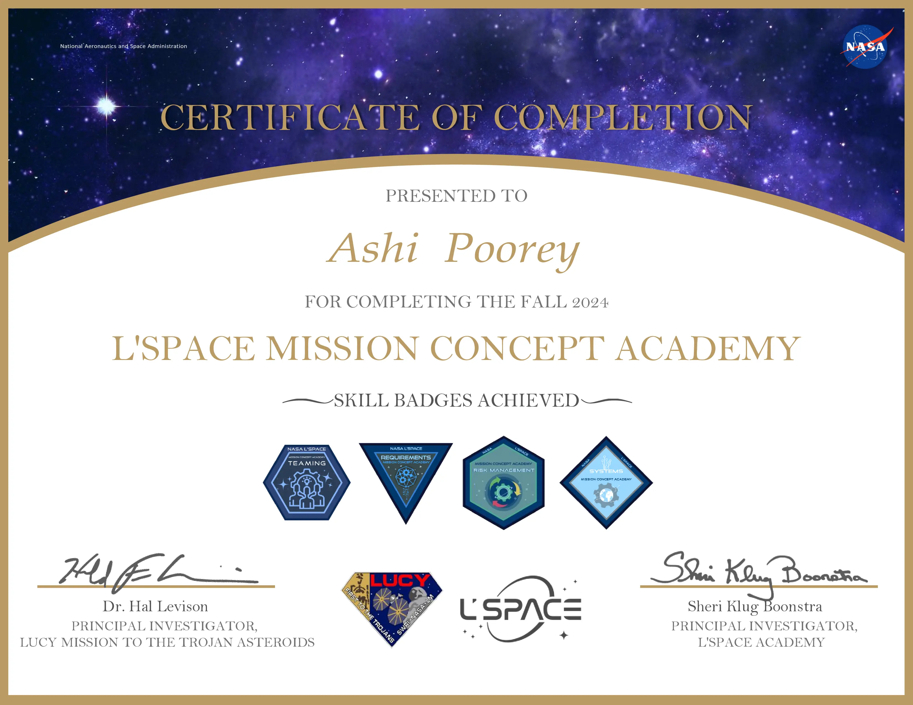

Mission Task:
- Identify at least 3 locations of lunar lava pits/caves that can be tested for their thermal isolation to be candidates locations to provide a stable environment for long-term lunar habitation to support human exploration of the Moon. After a trade study of the 3 Lunar lava pits/caves your team has identified, you will downselect to one final location to be explored for your mission tasks. 
- What investigations can be done to determine the structural integrity of the lava pits/caves to offer stability and safety for astronauts?
- Identify the type of high priority science as outlined in the current 2023 Planetary Decadal Survey or recommended (Lunar Exploration Analysis Group (LEAG)-based science as outlined in the current 2023 Planetary Decadal Survey or LEAG-based science that astronauts would have access to that is in proximity to your team’s identified lunar pit/cave(s) candidates.

I served as the Project Manager for a 12-member interdisciplinary team and integrated deliverables scoring among the top 10%.

## Final Preliminary Design Review (PDR)


<iframe src="../assets/nasa_lspace_pdr.pdf" width="100%" height="600px" frameborder="0" style="border:1px solid #ddd; border-radius:5px;"></iframe>


## Certificate

