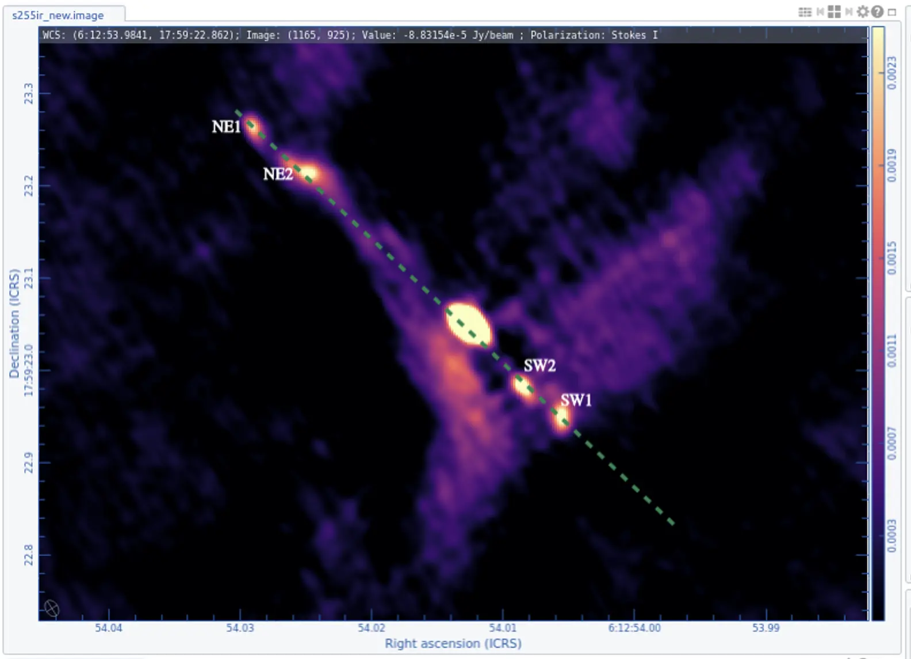

# ALMA Observations of S255IR NIRS3

## Project Overview
This project focuses on the high-mass star-forming region S255IR, specifically the protostar NIRS3, one of the best-studied massive protostars that has undergone an accretion outburst. Using high-resolution ALMA data (15 milliarcseconds, ~25 AU), the project reconstructs the continuum emission and analyzes the C³⁴S molecular line, providing insights into disk kinematics and jet structures.

---

## Scientific Goals
- Reproduce the continuum map of S255IR NIRS3 and resolve the central elongated source and associated jet knots.  
- Analyze the C³⁴S (7–6) molecular line to map disk kinematics and estimate the dynamical mass of the protostar using Keplerian rotation.

---

## Data & Methodology
- **Observations:** ALMA extended configuration, baselines up to 16 km, capturing both continuum and spectral lines (C³⁴S, SiO(8–7), CO).  
- **Software Tools:** CASA for calibration, imaging, and self-calibration; CARTA for visualization and figure production.  
- **Data Reduction Workflow:**
  1. Downloaded calibrated measurement sets (MS).  
  2. Applied autoselfcal and amplitude self-calibration (solution interval: 300s).  
  3. Imaging with `tclean`, adjusting cell sizes, cleaning masks, and visualization parameters (vmin/vmax) to match publication-quality figures.  
  4. Produced continuum and continuum-subtracted spectral-line cubes.

---

## Key Results

### 1. Continuum Map
- Successfully reproduced the central elongated core (~850 K) and four symmetric knots tracing the jet.  
- Self-calibration improved the signal-to-noise ratio (SNR) by ~1.6× overall and more than doubled near the bright core, while RMS noise dropped from 0.058 to 0.050 mJy/beam.  
- Enhanced dynamic range and sharper structures allowed clearer resolution of the continuum core and jet knots.
 

### 2. C³⁴S Molecular Line Analysis
- Created integrated intensity maps showing clumpy molecular structures consistent with the literature, indicating small-scale inhomogeneities in the disk.  
- Generated Position–Velocity (PV) diagrams tracing rotation across the disk.  
- Extracted velocity-radius data and applied the Keplerian-envelope method to estimate the protostellar mass.

### 3. Dynamical Mass Estimation
- Measured a disk radius of ~375 AU.  
- Derived M·sin²i ≈ 10.6 M⊙ (v=5 km/s) and 15.2 M⊙ (v=6 km/s), consistent with published Keplerian curves.  
- These estimates provide a direct physics-based measurement of the protostar’s mass from gas kinematics, a critical diagnostic in star-formation research.

---

## Technical Skills Applied
- Radio interferometric imaging and self-calibration  
- Molecular line cube analysis and continuum subtraction  
- Position–Velocity diagram creation and Keplerian mass calculation  
- Scientific visualization (publication-quality figures)  
- CASA, CARTA, and Python scripting for data analysis

---
