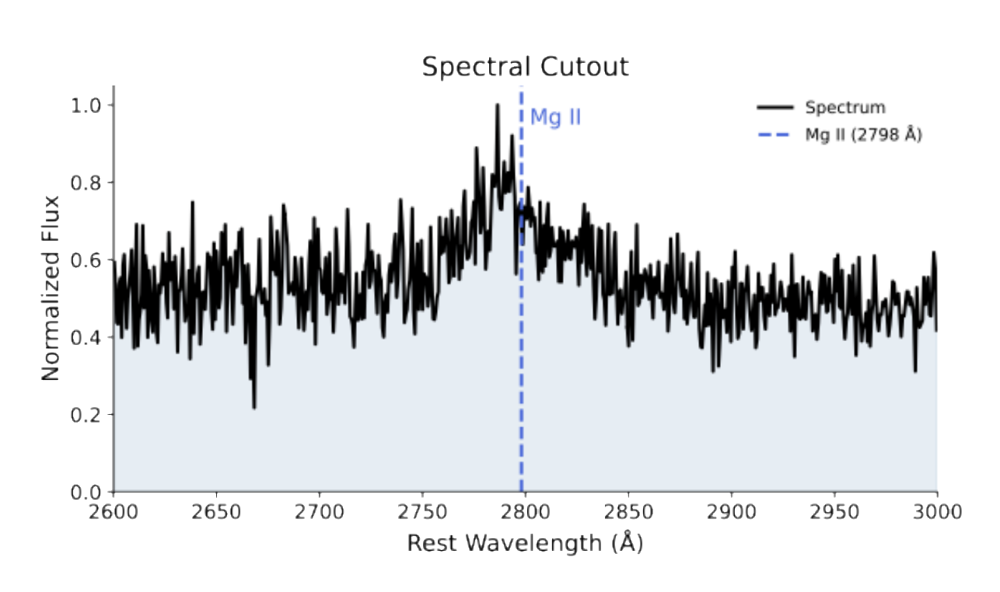
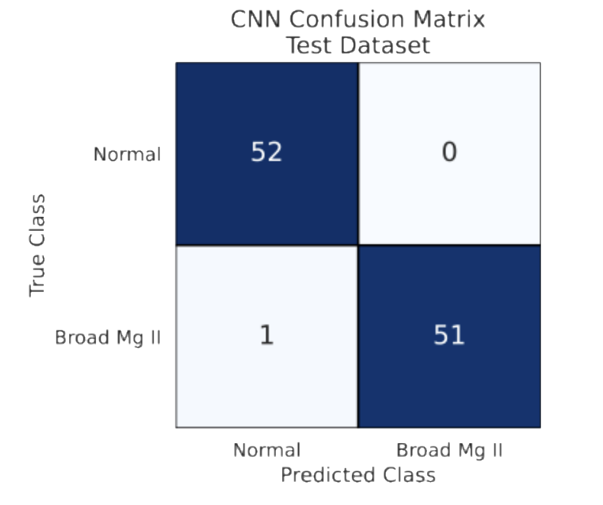

**Space Telescope Science Institute (STScI)**  
**Space Astronomy Summer Program (SASP) • Summer 2026**

---

## Project Overview

This research investigated whether machine learning can efficiently identify **broad Mg II emission galaxies**, a rare class of active galactic nuclei (AGN) that may represent **changing-look or fading black holes**. Broad Mg II galaxies comprise only a few hundred objects among more than one million SDSS galaxy spectra, making traditional visual inspection extremely time consuming.

The project developed a deep learning pipeline capable of automatically identifying candidate broad Mg II galaxies directly from Sloan Digital Sky Survey (SDSS) spectra.

---

## Scientific Motivation

Active galactic nuclei can rapidly transition between active and inactive states as the accretion rate onto their central supermassive black hole changes.

Broad Mg II emission is one observational signature of these changing systems.

Automatically identifying these rare galaxies enables astronomers to

- discover new changing-look AGN
- investigate black hole accretion variability
- build larger statistical samples for future spectroscopic follow-up

---

## Dataset

Training data consisted of

- Broad Mg II galaxies
- Normal SDSS galaxies

Each spectrum was

- shifted into the rest frame
- cropped around the Mg II emission line (2600–3000 Å)
- interpolated onto a common wavelength grid
- normalized prior to training

This preprocessing isolates the spectral region most relevant for identifying broad Mg II emission.

---

## Machine Learning Pipeline

The classification pipeline consisted of

1. Spectral preprocessing and wavelength normalization
2. Extraction of Mg II spectral cutouts
3. One-dimensional Convolutional Neural Network (CNN)
4. Training using weighted sampling to address class imbalance
5. Evaluation using precision, recall, ROC-AUC, and confusion matrices

---

## Model Architecture

The CNN consisted of

- Three 1D convolutional layers
- ReLU activations
- Max-pooling layers
- Fully connected classifier

The network learned spectral features associated with broad Mg II emission directly from flux values without manual feature engineering.

---

## Results

The trained classifier achieved excellent performance on the held-out testing dataset, including

- High precision
- High recall
- Near-perfect ROC-AUC
- Very few false positives or false negatives

The model successfully distinguished broad Mg II galaxies from normal SDSS galaxies while dramatically reducing the amount of manual inspection required.

---

## Example Spectral Cutout

Example rest-frame SDSS spectrum showing the Mg II emission region used for classification.

---

## Model Performance

Confusion matrix demonstrating the CNN's classification performance on the testing dataset.

---

## Technical Skills

- Python
- PyTorch
- NumPy
- SciPy
- Astropy
- FITS data processing
- Deep Learning
- Convolutional Neural Networks
- Scientific visualization
- SDSS spectroscopy

---

## Research Impact

This project demonstrates how modern deep learning techniques can accelerate the discovery of rare astrophysical objects in massive spectroscopic surveys. The developed workflow provides an efficient framework for identifying candidate changing-look AGN, enabling future studies of supermassive black hole evolution and time-domain astrophysics.

---

# Presentation

This work was presented at the SASP Symposium 2026.

[STScI SASP Presentation (PDF)](../assets/presentation_sasp.pdf)

<iframe
    src="../assets/presentation_sasp.pdf"
    width="100%"
    height="900px"
    style="border:1px solid #ddd; border-radius:8px;">
</iframe>
